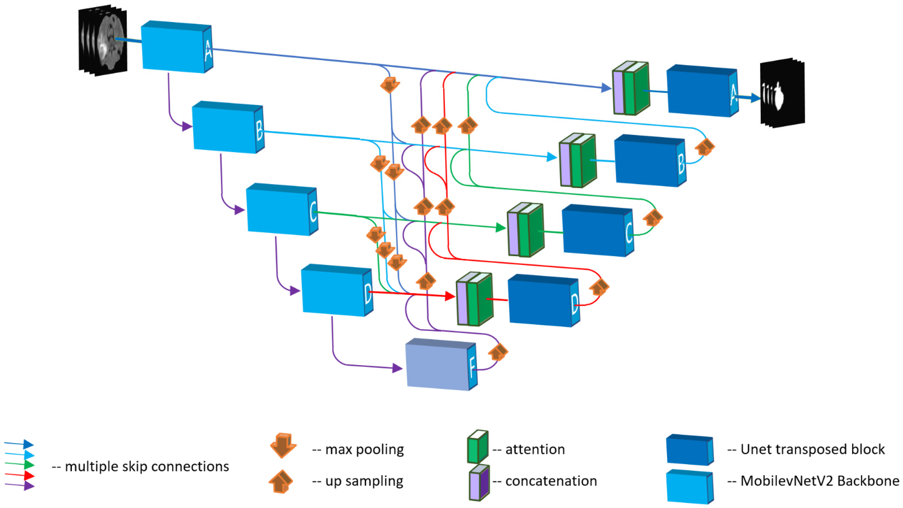
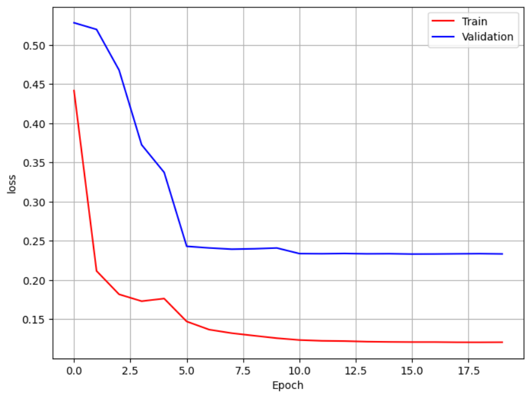
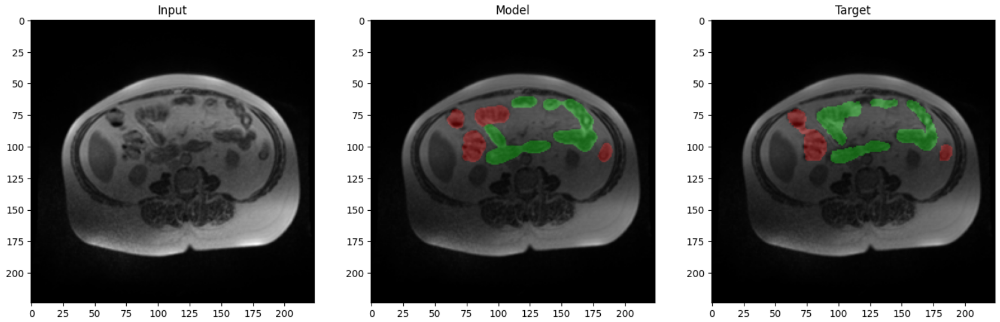

<div align="center">
  <a href="https://www.kaggle.com/competitions/uw-madison-gi-tract-image-segmentation">
    
  </a>

<h1 align="center">Medica Image Segmentation</h1>
</div>
    
## 1. Problem Statement
Radiation oncologists try to deliver high doses of radiation using X-ray beams pointed to tumors while avoiding the stomach and intestines. With newer technology such as integrated magnetic resonance imaging and linear accelerator systems, also known as MR-Linacs, oncologists are able to visualize the daily position of the tumor and intestines, which can vary day to day. In these scans, radiation oncologists must manually outline the position of the stomach and intestines in order to adjust the direction of the x-ray beams to increase the dose delivery to the tumor and avoid the stomach and intestines. This is a time-consuming and labor intensive process that can prolong treatments from 15 minutes a day to an hour a day, which can be difficult for patients to tolerate—unless deep learning could help automate the segmentation process. A method to segment the stomach and intestines would make treatments much faster and would allow more patients to get more effective treatment.
[Project Home Page](https://www.kaggle.com/competitions/uw-madison-gi-tract-image-segmentation/overview)
<div align="center">
  <a href="https://www.kaggle.com/competitions/uw-madison-gi-tract-image-segmentation">
    
  </a>
</div>

In this figure, the tumor (pink thick line) is close to the stomach (red thick line). High doses of radiation are directed to the tumor while avoiding the stomach. The dose levels are represented by the rainbow of outlines, with higher doses represented by red and lower doses represented by green.

However, this task presents challenges, which can be difficult even for experts. Given the sensitivity and importance of this field, failing to detect stomach in a patient can lead to significant problems.
Our model needs to meet the following criteria:

* High accuracy is essential, even if it sacrifices speed.
* The model should provide clear explanations because of the sensitive nature of this field.
* Thorough documentation is crucial for our project's success.


## 2. Related Works
there are several way to impelement segmentation algorithm for medical image classification. but we divide this into 2 group:
* Convloutional methods:
  * U-Net: The architecture consists of this model contracting path to capture context and a symmetric expanding path that enables precise localization.
  * V-net: V-Net extends U-Net by incorporating volumetric convolutions to handle 3D medical image segmentation.
  * DeepLab V3+: DeepLab V3+ employs atrous spatial pyramid pooling and encoder-decoder architecture with depthwise separable convolutions for dense prediction tasks.
    
* Transformer-Based Methods:
  * Vision Transformer (ViT): ViT is a transformer architecture initially proposed for image classification tasks. It divides the input image into fixed-size patches, linearly embeds them, and processes them using transformer blocks. Despite being designed for classification, ViT and its variants have been adapted for segmentation tasks in medical imaging.

  * SegFormer: SegFormer extends the transformer architecture for semantic segmentation tasks. It introduces a hybrid CNN-transformer backbone and employs a hierarchical transformer decoder to generate segmentation masks.

  * TransUNet: TransUNet combines the strengths of convolutional neural networks (CNNs) and transformers. It uses a CNN backbone to extract spatial features and a transformer decoder to capture global contextual information for semantic segmentation.

## 3. The Proposed Method
In this work, we propose the utilization of U-Net for our task. Our decision is supported by several reasons:

* Simplicity and Efficiency: U-Net offers a simple architecture with fewer parameters, facilitating easier training and optimization.

* Proven Performance: U-Net has demonstrated its effectiveness across various tasks in medical image analysis, consistently achieving state-of-the-art results.

* Versatility and Adaptability: The modular design of U-Net allows for easy customization and adaptation to different imaging modalities and applications.

* Robustness and Generalization: Due to its architectural characteristics, U-Net tends to generalize well to diverse datasets and imaging conditions.

* Community Support and Resources: U-Net enjoys widespread adoption in the research community, providing access to pre-trained models, implementation libraries, and extensive documentation
  


This figure illustrates the architecture of our designed U-Net model, which consists of a contracting path to capture contextual information and an expanding path for precise localization.

## 4. Implementation
In this part, we will discuss the different components of the project in detail.

### 4.1. Dataset
In this competition we are segmenting organs cells in images. The training annotations are provided as RLE-encoded masks, and the images are in 16-bit grayscale PNG format.

Each case in this competition is represented by multiple sets of scan slices (each set is identified by the day the scan took place). Some cases are split by time (early days are in train, later days are in test) while some cases are split by case - the entirety of the case is in train or test. The goal of this competition is to be able to generalize to both partially and wholly unseen cases.

* train.csv - IDs and masks for all training objects.
* sample_submission.csv - a sample submission file in the correct format
* train - a folder of case/day folders, each containing slice images for a particular case on a given day.
  
you can download dataset [here](https://www.kaggle.com/competitions/uw-madison-gi-tract-image-segmentation/data)

### 4.2. Model
In this project we use U-net, we implement U-net with 
For this project, we employ the U-Net architecture, a popular choice for image segmentation tasks. We use the [segmentation_models.pytorch](https://github.com/qubvel/segmentation_models.pytorch/tree/master) library for its implementation.
The segmentation model is a PyTorch nn.Module, which can be created as follows:

```python
import segmentation_models_pytorch as smp

model = smp.Unet(
    encoder_name="resnet34",        # choose encoder, e.g. mobilenet_v2 or efficientnet-b7
    encoder_weights="imagenet",     # use `imagenet` pre-trained weights for encoder initialization
    in_channels=1,                  # model input channels (1 for gray-scale images, 3 for RGB, etc.)
    classes=3,                      # model output channels (number of classes in your dataset)
)
```

### 4.3. Configurations
We use the Dice loss function and Dice Metric for training and evaluation, respectively. The model is optimized using the Stochastic Gradient Descent (SGD) optimizer with a multi-step learning rate scheduler.
```
optimizer = torch.optim.SGD(model.parameters(), lr=0.1, momentum=0.9)
loss_fn = smp.losses.DiceLoss(mode='multilabel')
lr_scheduler = optim.lr_scheduler.MultiStepLR(optimizer, milestones=[5, 10, 15], gamma=0.1)
```

The training parameters used are as follows:

```python
batch_size = 32
backbone = 'efficientnet-b1'
encoder_weights='imagenet'
num_classes = 3
classes = ['large_bowel', 'small_bowel', 'stomach']
lr = 0.1
momentum = 0.9
num_epochs = 20
```

### 4.4. Train
We train our model for 20 epochs and achieve the following performance:

* Train: loss = 0.121, dice metric = 0.874
* Validation: loss = 0.2331, dice metric = 0.799

The training progress is visualized in the following plot:




### 4.5. Evaluate
We achieve a dice metric of 0.7980851531028748 on the test set.
Loss of each class:

* Large Bowel Dice: 0.8132762312889099
* Small Bowel Dice: 0.7370530366897583
* Stomach Dice: 0.8681455254554749


